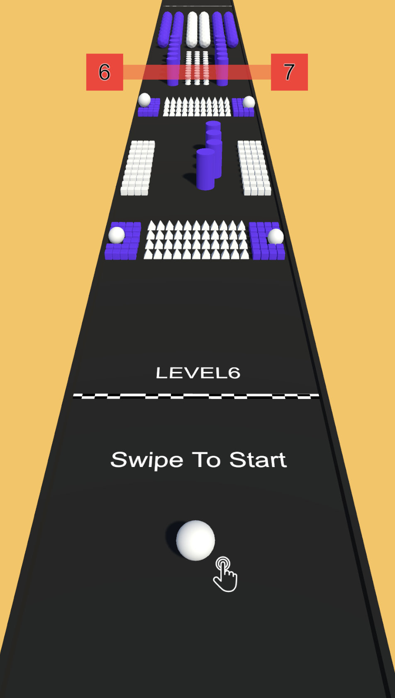

# Color-Bumb

Welcome to the **Color-Bumb** game repository! This Unity project is a swipe-controlled obstacle-avoidance game with dynamic challenges and level progression. The project is designed for mobile platforms and provides a fun, engaging experience for players of all ages.

## Table of Contents
- [Introduction](#introduction)
- [Features](#features)
- [Gameplay](#gameplay)
- [Installation](#installation)
- [Scripts Overview](#scripts-overview)
- [Contributing](#contributing)
- [Screenshots](#screenshots)

## Introduction

**Color-Bumb** is a Unity-based 3D game where players navigate a ball to avoid obstacles, reach the finish line, and progress to the next level. The game features intuitive swipe-based controls, smooth camera following, and visually dynamic environments.

## Features

- **Swipe-Based Controls:** Control the ball's movement by swiping left or right.
- **Dynamic Obstacles:** Challenging obstacles that move left and right to test your reflexes.
- **Level Progression:** Complete levels to unlock new ones.
- **Camera Follow System:** Smooth tracking of player movement for a seamless experience.
- **Collision Effects:** Destruction effects and slow-motion when hitting obstacles.

## Gameplay

1. **Start the game:** Tap on the screen to begin.
2. **Control the ball:** Swipe left or right to move the ball.
3. **Avoid obstacles:** Navigate through gaps and dodge enemy obstacles.
4. **Reach the finish line:** Progress to the next level after completing each stage.

## Installation

1. Clone the repository:
   ```bash
   git clone https://github.com/your-username/Color-Bumb.git
   ```
2. Open the project in Unity (recommended version: **2021.3** or later).
3. Load the `Level1` scene in the **Scenes** folder.
4. Press the Play button in Unity to test the game.

## Scripts Overview

### **1. CameraFollow.cs**
Controls the camera's smooth movement to follow the player.
- Tracks player progress.
- Moves forward dynamically.

### **2. ColorImage.cs**
Applies random colors to obstacles at runtime for visual variety.
- Uses Unity's `SpriteRenderer` to change colors.

### **3. GameManager.cs**
Manages the game's level progression, UI updates, and distance tracking.
- Updates level progress bars.
- Tracks the player's distance to the finish line.

### **4. LeftRightMove.cs**
Handles the left-right movement of obstacles within predefined boundaries.
- Moves obstacles dynamically.
- Stops movement upon collision with the player.

### **5. PlayerController.cs**
Main script for controlling the player's movement and handling game logic.
- Processes swipe gestures for ball movement.
- Handles collisions, game-over states, and level transitions.


## Screenshots

### Gameplay Screenshot


## Closing Notes

Thank you for exploring the **Color-Bumb** project! If you have questions or suggestions, feel free to open an issue in the repository. Have fun playing! 🎮

